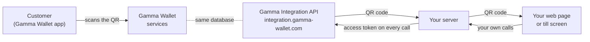

# Integrate with Gamma Wallet from your own code

Connect your shop, booking system or point of sale to **Gamma Wallet**, so your customers can:

1. **Earn a reward** for an order they paid: you show a QR code after payment, they scan it with Gamma Wallet, and the reward lands in their wallet.
2. **Settle an order with their store credits**: at checkout they choose **Use Store Credits with Gamma**, scan a QR code, and the whole order is settled from the credits they hold at your business.

This folder is for developers who write that connection themselves. It contains:

| | |
|---|---|
| [docs/WORKFLOWS.md](docs/WORKFLOWS.md) | Diagrams of both flows: who calls whom, and when |
| [docs/API-REFERENCE.md](docs/API-REFERENCE.md) | Every call, every field, every error |
| [samples/csharp](samples/csharp) | C# (.NET 8 or newer) |
| [samples/php](samples/php) | PHP 8.1 or newer, with cURL |
| [samples/node](samples/node) | Node.js 18 or newer, no dependencies |
| [samples/java](samples/java) | Java 11 or newer, no dependencies |

Every sample does the same four things: check the connection, declare a paid order and wait for the reward to be claimed, and start a store-credit request and wait for it to be settled.

## How it works in one picture



- **Your server** is the only thing that talks to Gamma. It holds the access token.
- **Your page** talks only to your server. It shows the QR code and asks your server, every few seconds, whether the customer has finished.
- **The customer** never types anything into your page. They scan the QR code with Gamma Wallet, and Gamma does the rest.

## Quick start

1. **Get an access token.** The business owner signs in at <https://business.gamma-wallet.com>, opens **Integrations**, and creates a token. It starts with `GWINT_` and is shown only once.
2. **Keep it on your server.** Put it in an environment variable or your secrets store. Never put it in a web page, a mobile app or a repository.
3. **Check it works:**

   ```bash
   curl https://integration.gamma-wallet.com/api/Connection/Me \
        -H "Authorization: Bearer GWINT_…"
   ```

   You get back the business it belongs to and the currency your amounts must be in.
4. **Run a sample** in your language. Each sample's README says how.

## The two flows

### 1. A reward for a paid order

```
customer pays  →  your server: Bill/Create  →  show the QR  →  customer scans  →  reward given
                  your server: Bill/Get every 5 s until "Claimed"
```

- Call `Bill/Create` **only after the order is paid**.
- The QR code never expires. You can also put the link or the QR image in the order confirmation email.
- Sending the same order number again returns the same bill, so the call is safe to retry.
- A bill can be claimed once.

### 2. Store credits for the whole order

```
customer picks "Use Store Credits with Gamma"  →  your server: Credit/Start  →  show the QR for 60 s
customer scans and confirms  →  credits redeemed
your server: Credit/Check every 5 s until "Paid" (complete the order) or "Expired" (offer to start again)
```

- Credits always cover the **whole** order, never part of it.
- The QR code is valid for **60 seconds**. Show a countdown. After that, start a new request.
- **Do not call `Bill/Create` for an order settled with store credits.** It earns no reward.

See [docs/WORKFLOWS.md](docs/WORKFLOWS.md) for the full diagrams, including what to do when the customer is shopping on their phone.

## Rules that keep it safe

- **Server to server only.** The API does not answer browsers, by design. Your page asks your server; your server asks Gamma.
- **One token per business.** The business always comes from the token. No call takes a business id, and a business only ever sees its own bills.
- **Amounts in the business's currency**, the code `Connection/Me` returns (for example `EUR`).
- **Poll politely.** Every 5 seconds per waiting order is plenty. Stop as soon as you get a final answer.
- **Watch the token's expiry.** `Connection/Me` returns `daysLeft`. Warn the business owner well before it reaches 0; they create a new token in Gamma Business.

## Before you go live

- [ ] The token is stored only on the server, never logged, never sent to the browser.
- [ ] `Bill/Create` is called only after payment, and never for an order settled with store credits.
- [ ] You keep the `billId` (or use your order number) to look a bill up later.
- [ ] Your page shows the QR code large enough to scan, and on a phone also shows the link as a button.
- [ ] The store-credit QR shows a 60-second countdown, and the customer can start again after it expires.
- [ ] Polling stops on `Claimed`, `Paid` or `Expired`, and when the customer leaves the page.
- [ ] Errors are handled as in [the error table](docs/API-REFERENCE.md#errors), including `429` (wait and retry).
- [ ] Someone gets warned when the token has few days left.

## Testing

There is no separate test environment yet: every call goes to the live service and every bill is real. Test with your own business, small amounts and order numbers you can recognise (for example `TEST-…`). A store-credit request that nobody settles leaves nothing behind.

## Words we use

- **Credits**, or **store credits**: value a customer earned at your business and can spend back there. Credits are a promise of value at your business. They are not money, and Gamma never handles money.
- **Reward contract**: the record Gamma keeps of every reward given and every credit redeemed.
- **Bill**: an order you declared as paid, so the customer can claim the reward for it.
