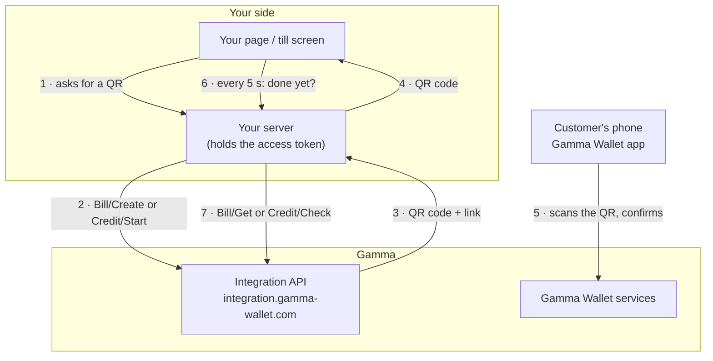
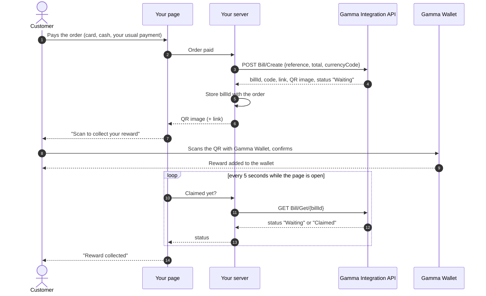
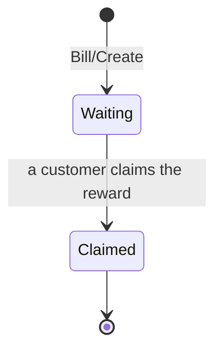
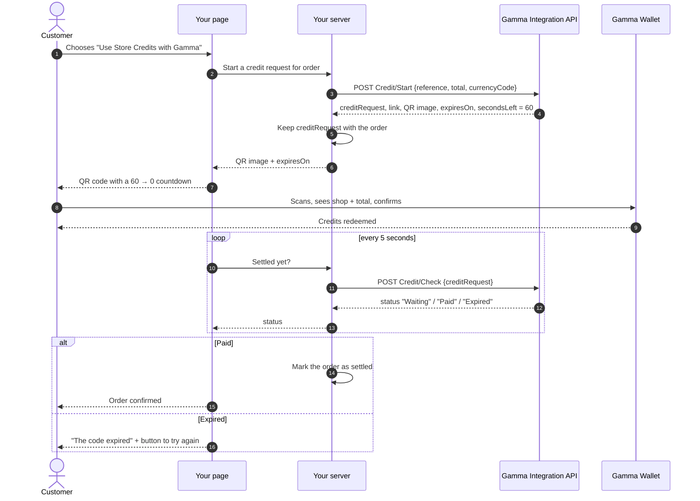
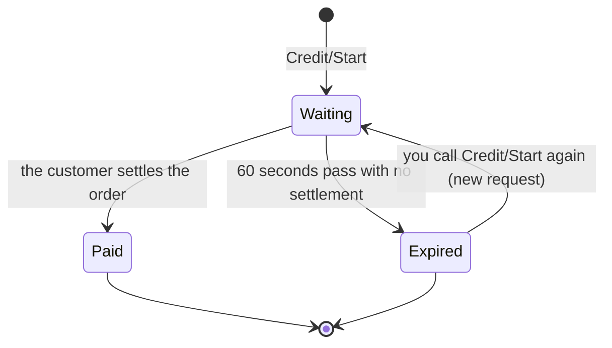
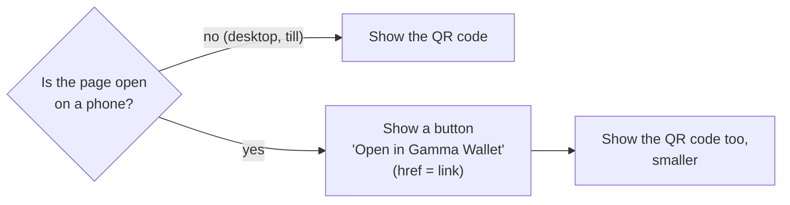
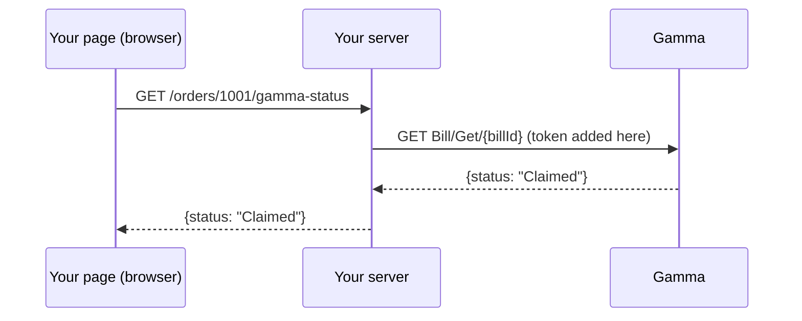

# Workflows

The diagrams below use [Mermaid](https://mermaid.js.org/), which GitHub and most documentation tools draw automatically.

## Who talks to whom

Your page never calls Gamma, and Gamma never calls your server. Everything is a plain HTTPS request from your server, and your server finds out the result by asking.

## Flow 1 — a reward for a paid order

Things to know:

- **The bill does not expire.** If the customer leaves without scanning, they can still use the link or QR from their confirmation email later.
- **Retrying is safe.** If your call to `Bill/Create` times out, send it again with the same `reference`: you get the same bill back. Sending a different total under the same `reference` is refused with `409`.
- **One claim per bill.** After a customer claims it, nobody else can.
- **You do not need to wait for the claim** to complete the order. Polling is only there so your page can say "reward collected".

### The bill's status

There is no cancel and no expiry: a bill stays `Waiting` until someone claims it.

## Flow 2 — the whole order settled with store credits

Things to know:

- **Whole order or nothing.** The amount is fixed by your request; the customer cannot change it and credits never cover part of an order.
- **60 seconds.** Show the countdown from `secondsLeft` (or `expiresOn`). When it reaches 0, keep asking: `Credit/Check` answers `Expired` only a few seconds later, once no payment can still arrive. Until then it answers `Waiting` with `secondsLeft: 0`.
- **One request settles once.** A second scan of the same QR is refused on the customer's side.
- **Nothing is stored until the customer settles.** An expired request leaves no trace; just start a new one.
- **No reward for this order.** Do not call `Bill/Create` for an order settled with store credits.
- **Keep `creditRequest` on your server.** It is what you send to `Credit/Check`. It is not secret, but it belongs to this one order.

### The credit request's status

## When the customer shops on their phone

A customer browsing your shop on their phone cannot scan a QR code on the same screen. Show the `link` as a button as well:

The link opens Gamma Wallet on the phone. If the app is not installed, it opens a page telling the customer how to get it.

## Your page and your server

Your page polls **your** server, not Gamma. A typical shape:

This keeps the token out of the browser and lets you decide what your page sees. The API refuses calls made from a web page on purpose.

## Choosing what to show

| Your order is… | Call | Show | Ask every 5 s with | Stop when |
|---|---|---|---|---|
| Paid normally | `Bill/Create` | QR "collect your reward" (no time limit) | `Bill/Get` | `Claimed`, or the customer leaves |
| To be settled with store credits | `Credit/Start` | QR "use your store credits" with a 60 s countdown | `Credit/Check` | `Paid` or `Expired` |
